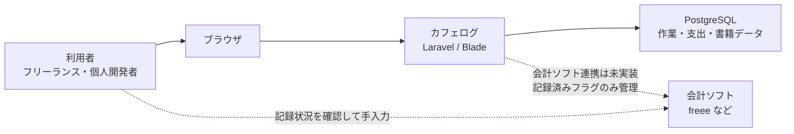
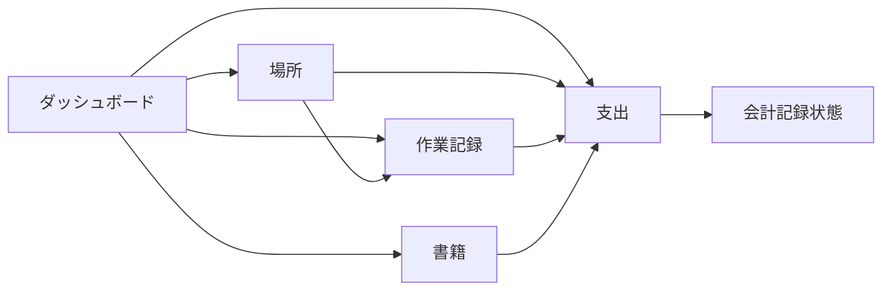
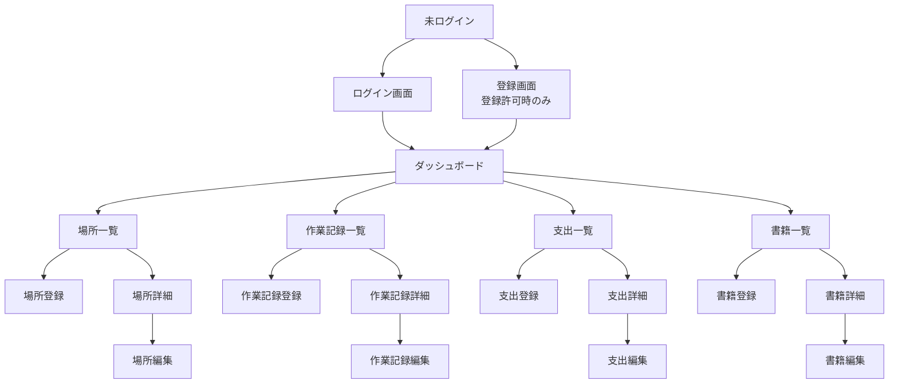
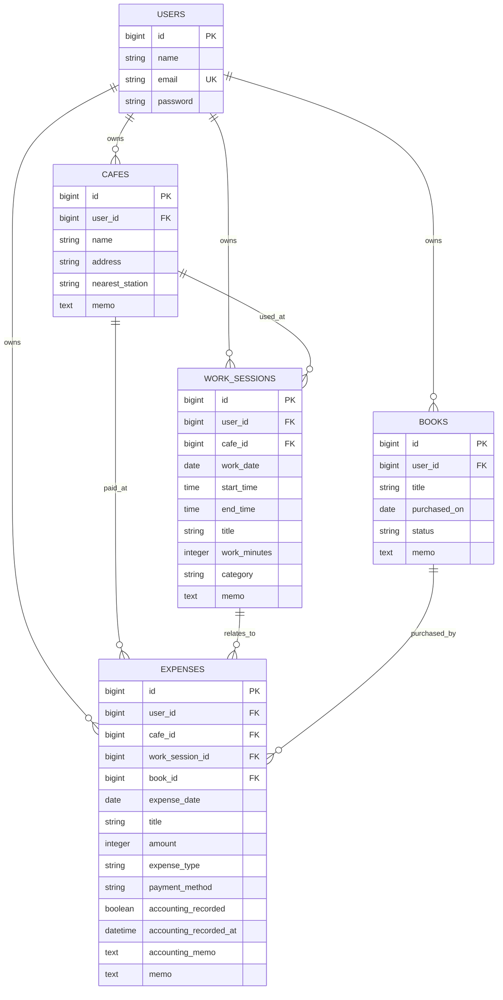
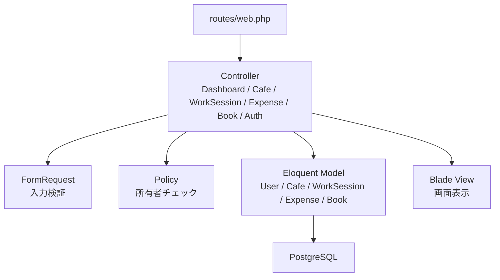
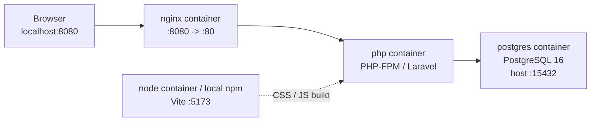
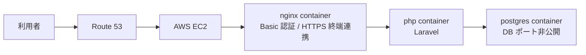
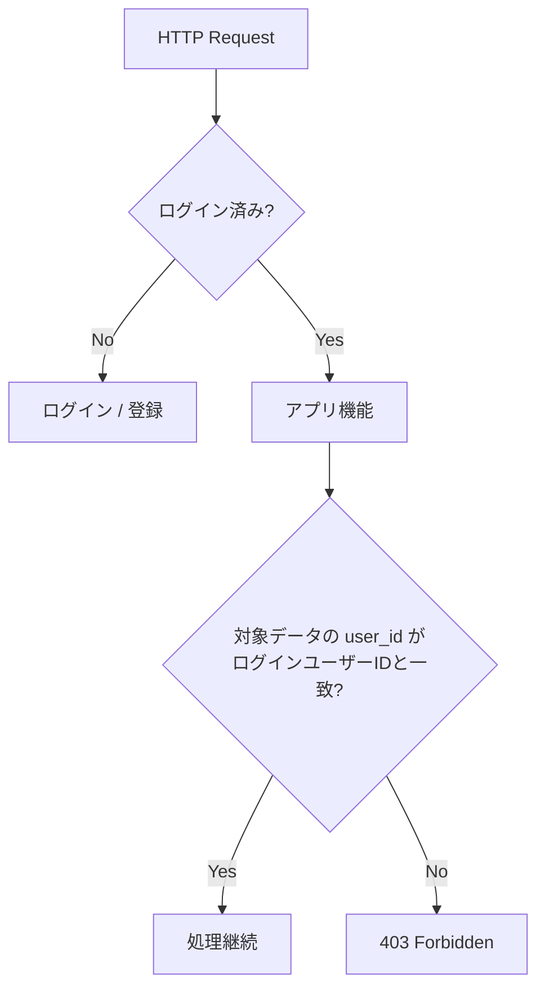

# カフェログ 基本設計書

作成日: 2026-06-02
対象: `cafe-work-expense-log` 現行コードベース

## 1. 目的

カフェログは、フリーランス・個人開発者が日々の作業場所、作業時間、支出、書籍購入、会計ソフトへの記録状況を一元管理するための Web アプリケーションである。

主な目的は次のとおり。

- カフェや自宅などで行った作業を、場所・日付・時間・カテゴリ付きで記録する
- カフェ代、書籍代、SaaS 代、交通費などの支出を記録する
- 支出が会計ソフトへ記録済みかどうかを管理する
- 作業記録・支出・書籍を関連付け、あとから振り返りやすくする
- 月次の作業時間、支出、未記録支出をダッシュボードで把握する

## 2. システム全体像



## 3. 業務範囲

```mermaid
flowchart TB
    root["カフェログ"]

    root --> auth["認証"]
    auth --> login["ログイン"]
    auth --> logout["ログアウト"]
    auth --> register["ユーザー登録\n本番では無効化可能"]

    root --> place["場所管理"]
    place --> placeCrud["場所の CRUD"]

    root --> work["作業記録管理"]
    work --> workCrud["作業記録の CRUD"]
    work --> workFilter["月・場所・カテゴリで絞り込み"]
    work --> workTotal["表示中の作業時間合計"]

    root --> expense["支出管理"]
    expense --> expenseCrud["支出の CRUD"]
    expense --> expenseFilter["月・種別・会計記録状態で絞り込み"]
    expense --> expenseTotal["表示中の支出合計"]
    expense --> expenseAccounting["会計ソフト記録済み / 未記録管理"]

    root --> book["書籍管理"]
    book --> bookCrud["書籍の CRUD"]
    book --> bookStatus["未読・読書中・読了・中断"]

    root --> dashboard["ダッシュボード"]
    dashboard --> monthlySummary["今月の作業・支出サマリ"]
    dashboard --> recentData["直近データ表示"]
```



## 4. 利用者とユースケース

| 利用者 | 利用目的 | 主な操作 |
|---|---|---|
| ログインユーザー | 自分の作業・支出・書籍を管理する | 場所登録、作業記録登録、支出登録、書籍登録、一覧確認、編集、削除 |
| 未ログインユーザー | アプリへログインする | ログイン、登録可能環境でのユーザー登録 |
| ポートフォリオ確認者 | アプリの動作を確認する | Basic 認証通過後、デモアカウントでログイン |

## 5. 機能構成



各機能の位置づけは次のとおり。

| 機能 | 役割 | 主なデータ |
|---|---|---|
| ダッシュボード | 今月の活動状況と直近データを表示する | 作業時間合計、支出合計、未記録支出数、書籍数 |
| 場所管理 | 作業場所を管理する | 場所名、住所、最寄駅、メモ |
| 作業記録管理 | 作業した内容と時間を管理する | 作業日、場所、開始時刻、終了時刻、作業時間、カテゴリ |
| 支出管理 | 作業関連の支出と会計記録状態を管理する | 支出日、金額、種別、支払方法、会計記録状態、関連データ |
| 書籍管理 | 購入書籍と読書状態を管理する | タイトル、購入日、読書状態、メモ |

## 6. 画面構成



## 7. データモデル概要



### データ設計方針

- 主要データはすべて `user_id` を持ち、ログインユーザー単位で分離する
- 場所・作業記録・書籍は支出へ任意で紐づける
- 場所や作業記録を削除しても支出履歴は残すため、支出側の関連外部キーは `nullOnDelete` とする
- ユーザーを削除した場合は、そのユーザーの場所・作業記録・支出・書籍も削除する

## 8. アプリケーション構成



### レイヤーの責務

| レイヤー | 役割 |
|---|---|
| Route | URL と Controller の対応付け、`auth` / `guest` ミドルウェア適用 |
| Controller | 画面表示、検索条件組み立て、登録・更新・削除の流れを制御 |
| FormRequest | 入力値の検証、時刻パーツの結合、関連 ID の妥当性確認 |
| Policy | 対象データがログインユーザー本人のものか判定 |
| Model | DB テーブルとの対応、リレーション、日付表示用アクセサ |
| Blade | 画面 HTML、共通レイアウト、フォーム部品 |

## 9. 実行環境構成

### 開発環境



### 本番環境



## 10. 認証・認可方針



認証・認可の主な方針は次のとおり。

- アプリ本体の画面は `auth` ミドルウェア配下に置く
- ログイン画面と登録画面は `guest` ミドルウェア配下に置く
- 本番環境では `ALLOW_USER_REGISTRATION=false` によりユーザー登録を無効化できる
- ログイン失敗はメールアドレスと IP アドレス単位でレート制限する
- 登録処理は IP アドレス単位でレート制限する
- 詳細・編集・更新・削除は Policy で所有者を確認する

## 11. 非機能要件

| 区分 | 方針 |
|---|---|
| セキュリティ | 認証必須、Policy による所有者チェック、登録無効化、レート制限、Basic 認証、DB ポート非公開 |
| 可用性 | 単一 EC2 + Docker Compose 構成。ポートフォリオ・個人用途のため大規模冗長化は対象外 |
| 保守性 | Controller / FormRequest / Policy / Model / Blade を分離し、責務を明確化 |
| テスト | Feature Test で CRUD、認証、認可、表示仕様、関連 ID の検証を確認 |
| 表示品質 | Tailwind CSS と Blade partial により、一覧・フォーム・ボタンの見た目を統一 |
| 運用 | 本番 `.env`、Docker Compose、HTTPS、Basic 認証、AWS Budgets によるコスト監視 |

## 12. 今後の拡張候補

```mermaid
flowchart LR
    current["現行機能"]
    graph["月別グラフ\nReact など"]
    csv["CSV エクスポート"]
    report["月別レポート"]
    attachment["領収書添付"]
    accountingList["会計未記録一覧の改善"]
    backup["バックアップ運用"]

    current --> graph
    current --> csv
    current --> report
    current --> attachment
    current --> accountingList
    current --> backup
```

現行設計では `expenses` に会計記録状態と関連データを集約しているため、CSV エクスポート、月別レポート、会計未記録支出一覧は比較的追加しやすい。
