# カフェログ 詳細設計書

作成日: 2026-06-02
対象: `cafe-work-expense-log` 現行コードベース

## 1. 設計対象

本書は、カフェログの Laravel 実装に対応する詳細設計をまとめる。

対象範囲は次のとおり。

- ルーティング
- Controller 処理
- FormRequest バリデーション
- Policy 認可
- Eloquent Model とリレーション
- DB テーブル定義
- Blade 画面構成
- テスト観点

## 2. 処理レイヤー構成

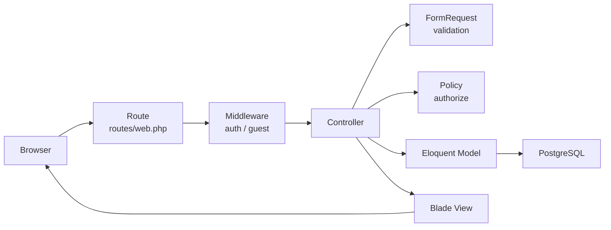

### 基本的な責務

| 要素 | 主なファイル | 責務 |
|---|---|---|
| Route | `routes/web.php` | URL、HTTP メソッド、Controller、認証要否を定義 |
| Controller | `app/Http/Controllers/*` | 検索条件、CRUD、リダイレクト、View 変数を制御 |
| FormRequest | `app/Http/Requests/*` | 入力値検証、時刻パーツ変換、関連 ID の検証 |
| Policy | `app/Policies/*` | 対象レコードの所有者チェック |
| Model | `app/Models/*` | テーブル対応、fillable、casts、リレーション、表示用アクセサ |
| View | `resources/views/*` | 画面表示、フォーム、一覧、共通レイアウト |

## 3. ルート設計

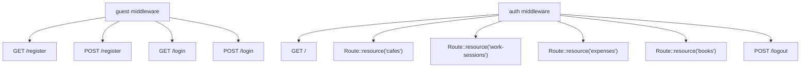

| 区分 | メソッド | パス | ルート名 | Controller |
|---|---:|---|---|---|
| 認証 | GET | `/login` | `login` | `AuthenticatedSessionController@create` |
| 認証 | POST | `/login` | `login` | `AuthenticatedSessionController@store` |
| 認証 | POST | `/logout` | `logout` | `AuthenticatedSessionController@destroy` |
| 登録 | GET | `/register` | `register` | `RegisteredUserController@create` |
| 登録 | POST | `/register` | `register` | `RegisteredUserController@store` |
| ダッシュボード | GET | `/` | `dashboard` | `DashboardController@index` |
| 場所 | REST | `/cafes` | `cafes.*` | `CafeController` |
| 作業記録 | REST | `/work-sessions` | `work-sessions.*` | `WorkSessionController` |
| 支出 | REST | `/expenses` | `expenses.*` | `ExpenseController` |
| 書籍 | REST | `/books` | `books.*` | `BookController` |

## 4. 認証詳細

### ログイン処理

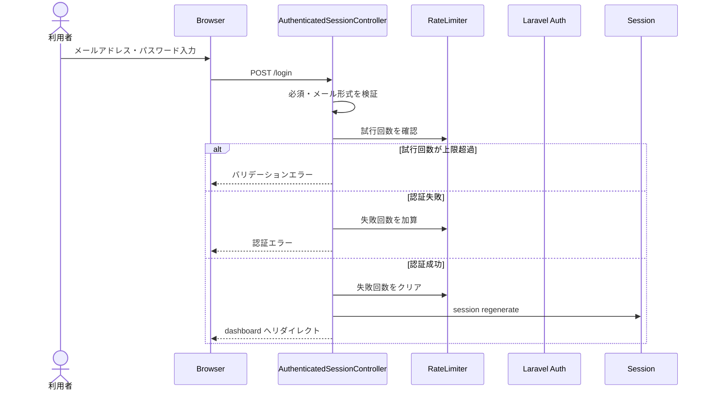

### 登録処理

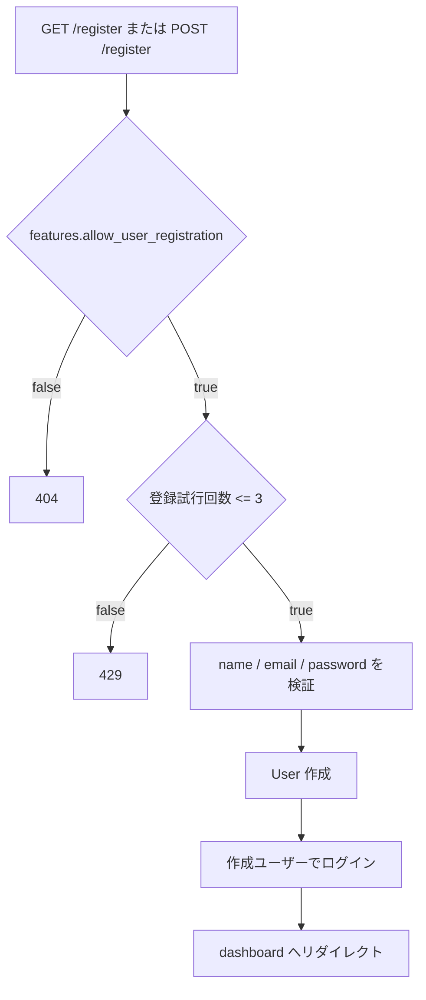

## 5. 認可設計

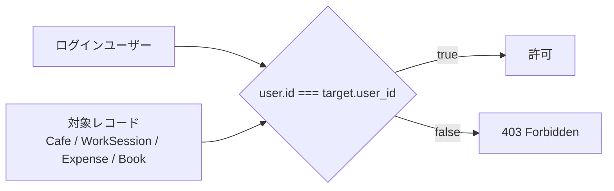

| 対象 | view | create | update | delete | restore / forceDelete |
|---|---|---|---|---|---|
| Cafe | 所有者のみ | ログイン済みなら可 | 所有者のみ | 所有者のみ | 不可 |
| WorkSession | 所有者のみ | ログイン済みなら可 | 所有者のみ | 所有者のみ | 不可 |
| Expense | 所有者のみ | ログイン済みなら可 | 所有者のみ | 所有者のみ | 不可 |
| Book | 所有者のみ | ログイン済みなら可 | 所有者のみ | 所有者のみ | 不可 |

一覧画面は Controller の `where('user_id', auth()->id())` でログインユーザーのデータだけ取得する。詳細、編集、更新、削除は Policy の `authorize()` で所有者を確認する。

## 6. モデル設計

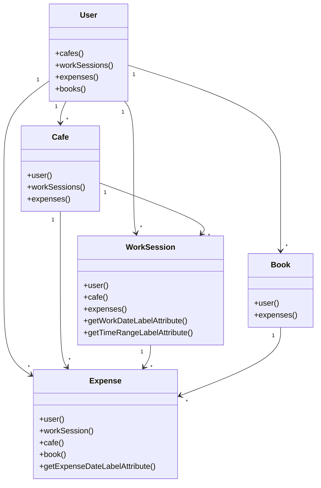

### Model 別の主な実装

| Model | fillable / 属性 | casts | 補足 |
|---|---|---|---|
| User | `name`, `email`, `password` | `email_verified_at: datetime`, `password: hashed` | Laravel 標準認証ユーザー |
| Cafe | `user_id`, `name`, `address`, `nearest_station`, `memo` | なし | UI 上は自宅やラウンジも含む「場所」 |
| WorkSession | `user_id`, `cafe_id`, `work_date`, `start_time`, `end_time`, `title`, `work_minutes`, `category`, `memo` | `work_date: date` | 曜日付き日付、時間帯ラベルを提供 |
| Expense | `user_id`, `work_session_id`, `cafe_id`, `book_id`, `expense_date`, `title`, `amount`, `expense_type`, `payment_method`, `accounting_recorded`, `accounting_recorded_at`, `accounting_memo`, `memo` | `expense_date: date`, `accounting_recorded: boolean`, `accounting_recorded_at: datetime` | 会計ソフト記録状態を保持 |
| Book | `user_id`, `title`, `purchased_on`, `status`, `memo` | `purchased_on: date` | 支出と任意で関連付け |

## 7. DB 詳細設計

### テーブル関係

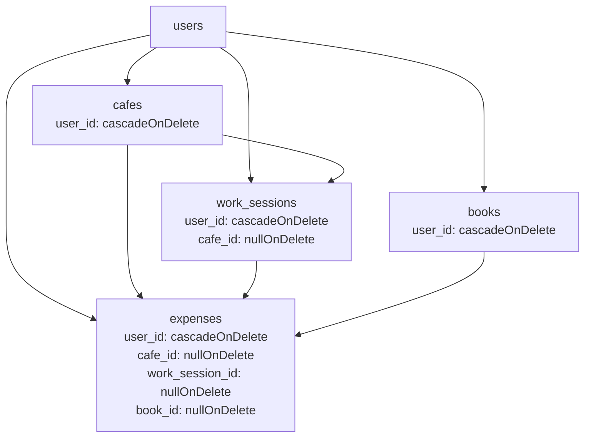

### `users`

| カラム | 型 | 必須 | 制約 / 用途 |
|---|---|---:|---|
| `id` | bigint | Yes | 主キー |
| `name` | string | Yes | ユーザー名 |
| `email` | string | Yes | 一意 |
| `email_verified_at` | timestamp | No | メール認証日時。現行画面では未使用 |
| `password` | string | Yes | ハッシュ化パスワード |
| `remember_token` | string | No | ログイン保持 |
| `created_at` / `updated_at` | timestamp | No | 作成・更新日時 |

### `cafes`

| カラム | 型 | 必須 | 制約 / 用途 |
|---|---|---:|---|
| `id` | bigint | Yes | 主キー |
| `user_id` | bigint | Yes | `users.id`。ユーザー削除時に削除 |
| `name` | string(255) | Yes | 場所名 |
| `address` | string(255) | No | 住所 |
| `nearest_station` | string(255) | No | 最寄駅 |
| `memo` | text | No | メモ |
| `created_at` / `updated_at` | timestamp | No | 作成・更新日時 |

### `work_sessions`

| カラム | 型 | 必須 | 制約 / 用途 |
|---|---|---:|---|
| `id` | bigint | Yes | 主キー |
| `user_id` | bigint | Yes | `users.id`。ユーザー削除時に削除 |
| `cafe_id` | bigint | No | `cafes.id`。場所削除時は null |
| `work_date` | date | Yes | 作業日 |
| `start_time` | time | No | 開始時刻 |
| `end_time` | time | No | 終了時刻 |
| `title` | string(255) | Yes | 作業タイトル |
| `work_minutes` | unsigned integer | No | 作業時間。10 分単位 |
| `category` | string(50) | No | カテゴリ |
| `memo` | text | No | メモ |
| `created_at` / `updated_at` | timestamp | No | 作成・更新日時 |

### `expenses`

| カラム | 型 | 必須 | 制約 / 用途 |
|---|---|---:|---|
| `id` | bigint | Yes | 主キー |
| `user_id` | bigint | Yes | `users.id`。ユーザー削除時に削除 |
| `work_session_id` | bigint | No | `work_sessions.id`。作業記録削除時は null |
| `cafe_id` | bigint | No | `cafes.id`。場所削除時は null |
| `book_id` | bigint | No | `books.id`。書籍削除時は null |
| `expense_date` | date | Yes | 支出日 |
| `title` | string(255) | Yes | 支出内容 |
| `amount` | unsigned integer | Yes | 金額 |
| `expense_type` | string(50) | Yes | `cafe`, `book`, `saas`, `transport`, `other` |
| `payment_method` | string(50) | No | `cash`, `card`, `qr`, `other` |
| `accounting_recorded` | boolean | Yes | 会計ソフト記録済みフラグ。初期値 false |
| `accounting_recorded_at` | datetime | No | 会計ソフト記録日時 |
| `accounting_memo` | text | No | 会計メモ |
| `memo` | text | No | メモ |
| `created_at` / `updated_at` | timestamp | No | 作成・更新日時 |

### `books`

| カラム | 型 | 必須 | 制約 / 用途 |
|---|---|---:|---|
| `id` | bigint | Yes | 主キー |
| `user_id` | bigint | Yes | `users.id`。ユーザー削除時に削除 |
| `title` | string(255) | Yes | 書籍タイトル |
| `purchased_on` | date | No | 購入日 |
| `status` | string(50) | No | `unread`, `reading`, `done`, `paused` |
| `memo` | text | No | メモ |
| `created_at` / `updated_at` | timestamp | No | 作成・更新日時 |

## 8. Controller 詳細

### ダッシュボード

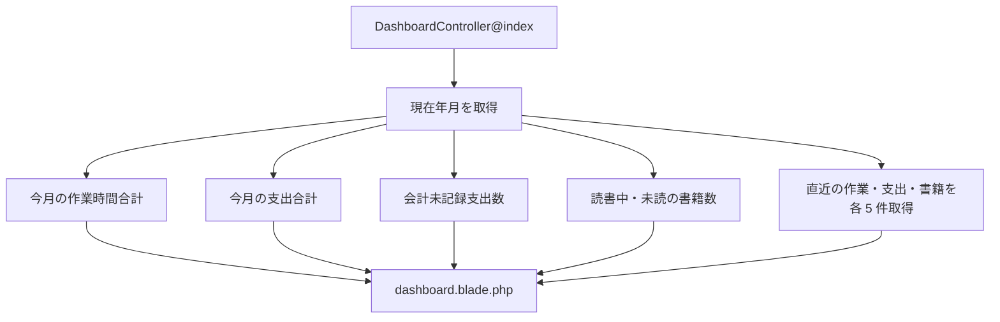

| 表示項目 | 取得条件 |
|---|---|
| 今月の作業時間 | `work_sessions.user_id = auth()->id()` かつ `work_date` が当月 |
| 今月の支出合計 | `expenses.user_id = auth()->id()` かつ `expense_date` が当月 |
| 会計未記録支出数 | `accounting_recorded = false` |
| 直近の作業記録 | `work_date` 降順、作成順降順、最大 5 件 |
| 直近の支出 | `expense_date` 降順、作成順降順、最大 5 件 |
| 読書中 / 未読の書籍数 | `books.status` が `reading` / `unread` |
| 直近の書籍 | 作成順降順、最大 5 件 |

### 場所管理

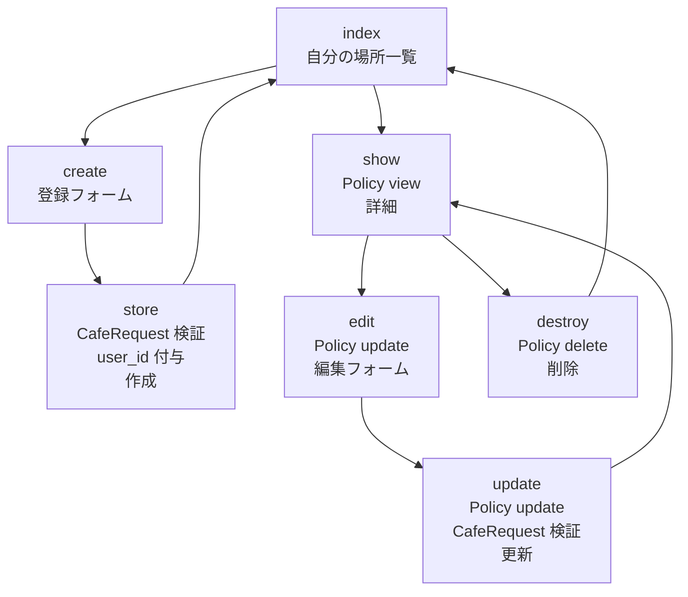

### 作業記録管理

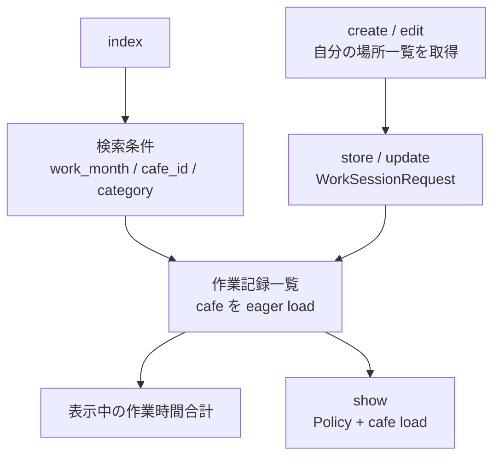

| 検索条件 | パラメータ | 条件 |
|---|---|---|
| 作業月 | `work_month` | `work_date` の年・月 |
| 場所 | `cafe_id` | `work_sessions.cafe_id` |
| カテゴリ | `category` | `work_sessions.category` |

### 支出管理

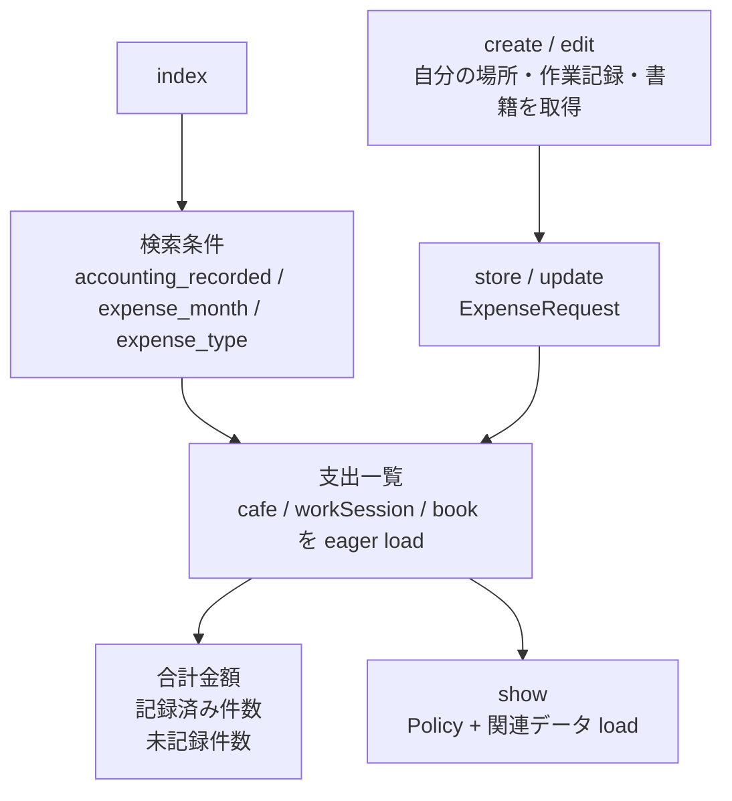

| 検索条件 | パラメータ | 条件 |
|---|---|---|
| 会計記録状態 | `accounting_recorded` | `true` または `false` |
| 支出月 | `expense_month` | `expense_date` の年・月 |
| 支出種別 | `expense_type` | `cafe`, `book`, `saas`, `transport`, `other` |

### 書籍管理

## 9. バリデーション詳細

### 場所

| 項目 | ルール | 備考 |
|---|---|---|
| `name` | required, string, max:255 | 表示名は「場所名」 |
| `address` | nullable, string, max:255 | 任意 |
| `nearest_station` | nullable, string, max:255 | 任意 |
| `memo` | nullable, string | 任意 |

### 作業記録

| 項目 | ルール | 備考 |
|---|---|---|
| `cafe_id` | nullable, exists:cafes,id | 場所は任意 |
| `work_date` | required, date | 作業日 |
| `start_time` | nullable, date_format:H:i | `start_time_hour` / `start_time_minute` から生成 |
| `end_time` | nullable, date_format:H:i | `end_time_hour` / `end_time_minute` から生成 |
| `title` | required, string, max:255 | 作業タイトル |
| `work_minutes` | nullable, integer, min:0, multiple_of:10 | 10 分単位 |
| `category` | nullable, string, max:50 | 任意 |
| `memo` | nullable, string | 任意 |

#### 作業時刻の追加チェック

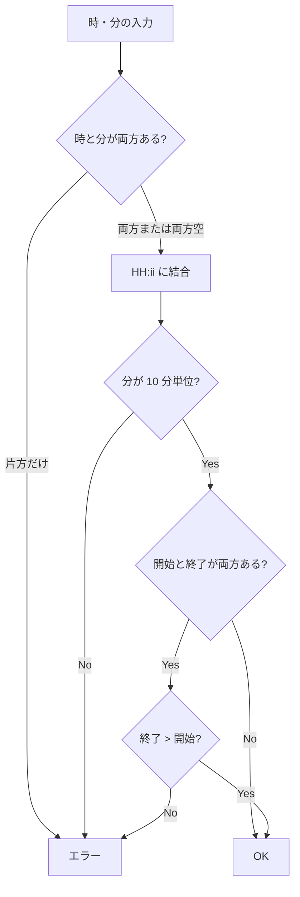

### 支出

| 項目 | ルール | 備考 |
|---|---|---|
| `expense_date` | required, date | 支出日 |
| `title` | required, string, max:255 | 表示名は「支出内容」 |
| `amount` | required, integer, min:0 | 金額 |
| `expense_type` | required, string, max:50 | 支出種別 |
| `payment_method` | nullable, string, max:50 | 支払方法 |
| `cafe_id` | nullable, exists:cafes,id | 関連場所 |
| `work_session_id` | nullable, exists:work_sessions,id | 関連作業記録 |
| `book_id` | nullable, exists:books,id where user_id = login user | 他ユーザーの書籍は指定不可 |
| `accounting_recorded` | nullable, boolean | チェックボックス |
| `accounting_recorded_at` | nullable, date | 会計記録日時 |
| `accounting_memo` | nullable, string | 会計メモ |
| `memo` | nullable, string | メモ |

### 書籍

| 項目 | ルール | 備考 |
|---|---|---|
| `title` | required, string, max:255 | 書籍タイトル |
| `purchased_on` | nullable, date | 購入日 |
| `status` | nullable, string, max:50 | 読書状態 |
| `memo` | nullable, string | 任意 |

## 10. 主要シーケンス

### 作業記録登録

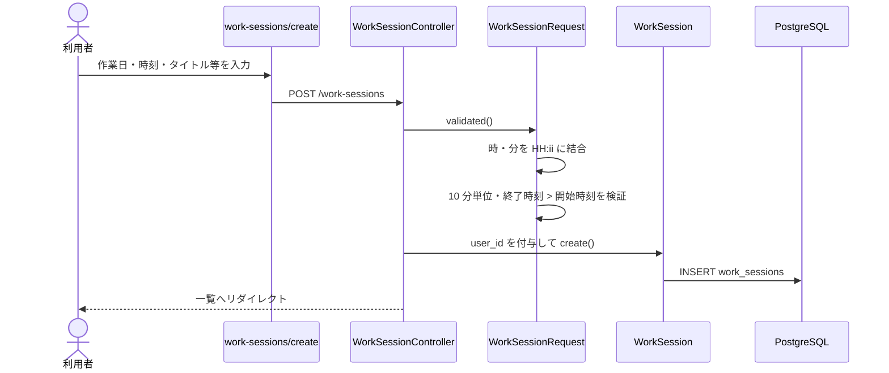

### 支出登録

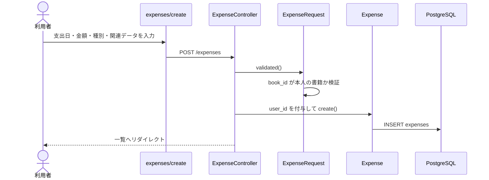

### 他ユーザーデータへの直接アクセス

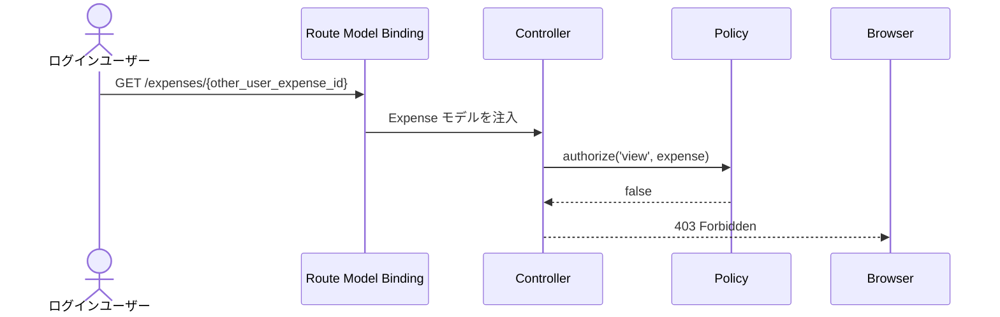

## 11. 画面詳細

### 共通レイアウト

| 要素 | 内容 |
|---|---|
| レイアウト | `resources/views/layouts/app.blade.php` |
| タイトル | `@yield('title', 'カフェログ')` |
| CSS / JS | Vite で `resources/css/app.css`, `resources/js/app.js` を読み込み |
| ヘッダー | アプリ名、説明、ログインユーザー名、ログアウト |
| ナビゲーション | ダッシュボード、場所、書籍、作業記録、支出 |
| フラッシュ | `session('status')` を表示 |
| エラー | `$errors` を一覧表示 |

### 共通部品

| 部品 | ファイル | 用途 |
|---|---|---|
| 場所 select | `partials/cafe-select.blade.php` | 作業記録、支出で場所を選択 |
| 書籍 select | `partials/book-select.blade.php` | 支出で関連書籍を選択 |
| 時刻 select | `partials/time-select.blade.php` | 作業記録で時・分を選択 |
| 支出種別 select | `partials/expense-type-select.blade.php` | 支出登録・編集・一覧絞り込み |

### 選択肢

| 項目 | 値 | 表示 |
|---|---|---|
| 支出種別 | `cafe` | カフェ代 |
| 支出種別 | `book` | 書籍代 |
| 支出種別 | `saas` | SaaS代 |
| 支出種別 | `transport` | 交通費 |
| 支出種別 | `other` | その他 |
| 支払方法 | `cash` | 現金 |
| 支払方法 | `card` | カード |
| 支払方法 | `qr` | QR |
| 支払方法 | `other` | その他 |
| 書籍状態 | `unread` | 未読 |
| 書籍状態 | `reading` | 読書中 |
| 書籍状態 | `done` | 読了 |
| 書籍状態 | `paused` | 中断 |

## 12. 表示用アクセサ

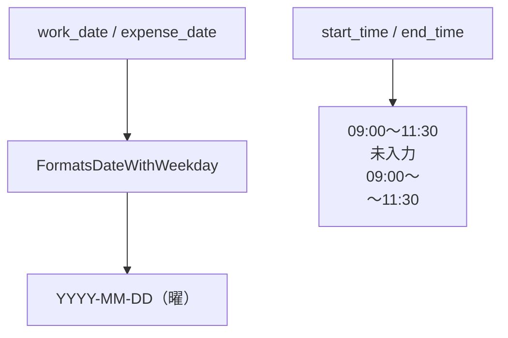

| 対象 | アクセサ | 表示例 |
|---|---|---|
| WorkSession | `work_date_label` | `2026-05-19（火）` |
| Expense | `expense_date_label` | `2026-05-20（水）` |
| WorkSession | `time_range_label` | `09:00〜11:30`、`未入力` |

## 13. 削除時の挙動

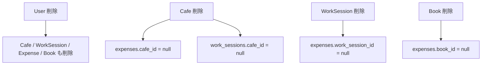

支出は会計・確定申告準備に関わる履歴のため、関連する場所、作業記録、書籍が削除されても支出自体は残す。

## 14. テスト設計

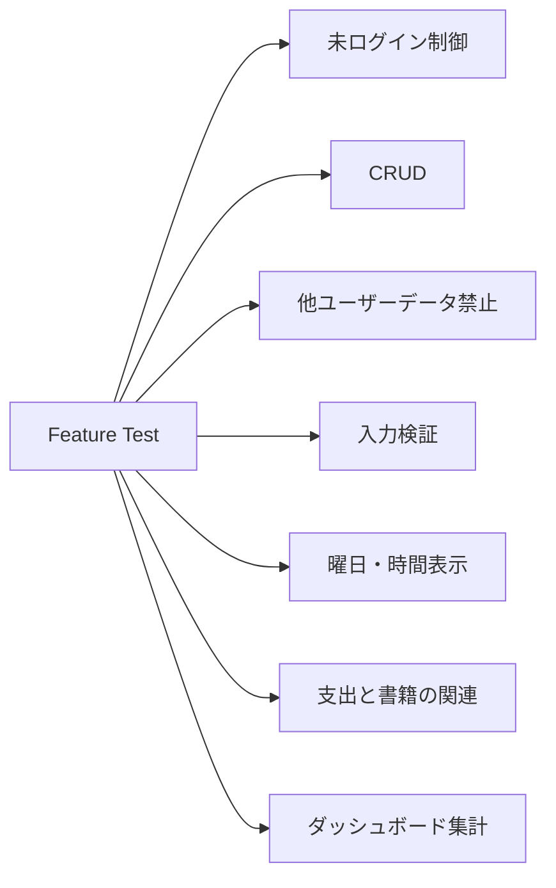

| テスト | 主な確認内容 |
|---|---|
| `CafeTest` | 場所一覧、作成、詳細、更新、削除、他ユーザー操作禁止 |
| `WorkSessionTest` | 作業記録 CRUD、曜日表示、時間帯表示、時刻整合性、10 分単位 |
| `ExpenseTest` | 支出 CRUD、曜日表示、他ユーザー操作禁止、書籍関連付け、他ユーザー書籍の指定禁止 |
| `BookTest` | 書籍 CRUD、他ユーザー操作禁止 |
| `DashboardTest` | 書籍サマリ、自分のデータのみ表示、作業・支出の日付表示 |

## 15. 実装上の注意点

- `Cafe` はモデル名としてはカフェだが、画面上は自宅やラウンジを含む「場所」として扱う
- `work_sessions.start_time` と `end_time` は任意入力だが、片方の時または分だけ入力された場合はエラーにする
- `work_minutes` は開始・終了時刻から自動計算せず、ユーザー入力値として保持する
- `expenses.book_id` はログインユーザー本人の書籍に限定して検証している
- `expenses.cafe_id` と `expenses.work_session_id` は現行ルールでは存在確認のみで、本人所有チェックは `book_id` ほど厳密には実装されていない
- 一覧の集計値は、絞り込み後に取得した Collection を対象に算出する
- 本番で登録を止める場合は `.env` の `ALLOW_USER_REGISTRATION=false` を前提にする

## 16. 変更時の確認観点

| 変更内容 | 確認すること |
|---|---|
| 画面項目を追加 | migration、Model fillable、FormRequest、Blade、Feature Test を更新 |
| 関連 ID を追加 | 自分のデータだけ指定できるか、Policy または FormRequest で確認 |
| 一覧の絞り込み追加 | クエリ条件、フォームの selected 状態、集計値への反映を確認 |
| 支出関連の変更 | 会計記録状態、月次集計、未記録件数、関連データ削除時の挙動を確認 |
| 認証設定の変更 | 登録可否、レート制限、ログイン後リダイレクト、ログアウトを確認 |
